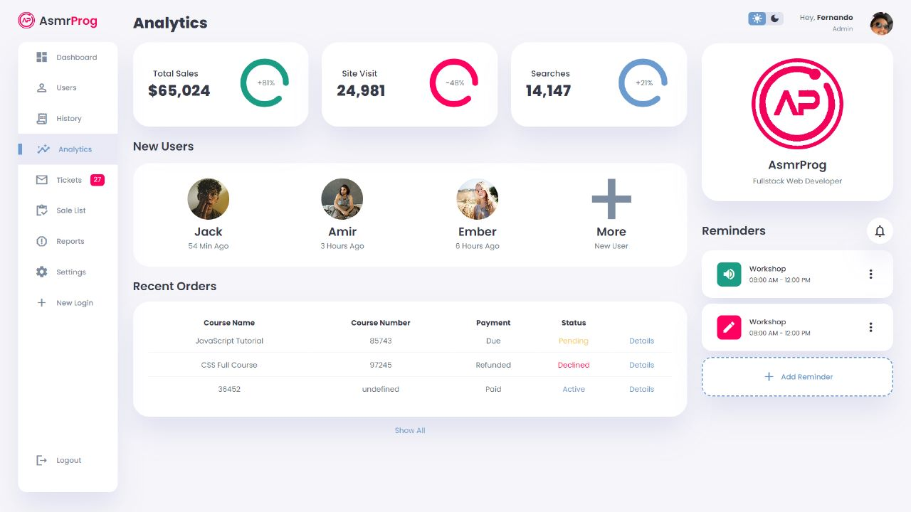
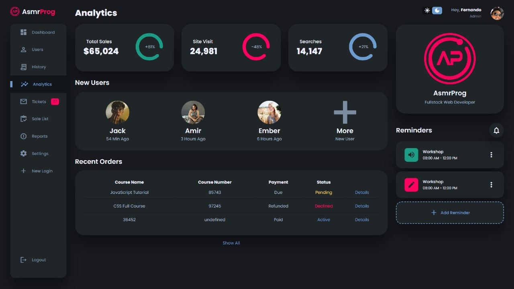

# Dashbord Responsivo

Este é um aplicativo de dashboard responsivo, projetado para fornecer informações e análises sobre vendas, visitas ao site e muito mais. Ele é construído com HTML, CSS e JavaScript puro, e também utiliza ícones da biblioteca Material Icons Sharp.

Esse projeto foi feito graças ao tutorial do canal ASMR Programming.

# Screenshot
Fotos do Projeto :

## Como Usar

1. Clone ou faça o download deste repositório para a sua máquina local.

2. Abra o arquivo `index.html` no seu navegador da web.

3. O aplicativo de dashboard responsivo será carregado no navegador.

## Funcionalidades

- **Sidebar**: O aplicativo possui uma barra lateral (sidebar) com links para diferentes seções do dashboard, como Dashboard, Users, History, Analytics, Tickets, Sale List, Reports, Settings, New Login e Logout.

- **Dark Mode**: Você pode alternar entre os modos de luz e escuro usando os ícones localizados no canto superior direito da barra de navegação.

- **Perfil do Usuário**: A barra de navegação também exibe o perfil do usuário logado, incluindo uma foto de perfil, nome de usuário e papel (Admin).

- **Análises**: O dashboard apresenta análises de vendas, visitas ao site e buscas. Cada análise é representada por um círculo com uma porcentagem que indica o aumento ou diminuição em relação ao período anterior.

- **Novos Usuários**: A seção "New Users" exibe os perfis dos usuários mais recentes, com seus nomes e horários de registro.

- **Pedidos Recentes**: A seção "Recent Orders" exibe uma tabela com os nomes dos cursos, números dos cursos, status de pagamento e status dos pedidos mais recentes.

- **Lembretes**: A seção "Reminders" exibe lembretes importantes, como workshops, com suas respectivas horas de início e término. Você também pode adicionar novos lembretes.

## Estrutura do Código

- `index.html`: Contém a estrutura HTML do aplicativo de dashboard.

- `style.css`: O arquivo CSS com estilos para o layout e aparência do aplicativo.

- `orders.js`: Arquivo com o array `Orders` contendo dados de exemplo para preencher a tabela de "Recent Orders".

- `index.js`: Script JavaScript que manipula a criação de linhas na tabela e algumas interações com a barra lateral e lembretes.

## Contribuição

Contribuições são bem-vindas! Se você encontrar algum problema ou tiver alguma sugestão de melhoria, sinta-se à vontade para abrir um issue ou enviar um pull request.

## Licença

Este projeto está incluso no canal do ASMR Programming, se tratando de um tutorial feito para melhorar e mostrar mais sobre as tecnologias que domino.
